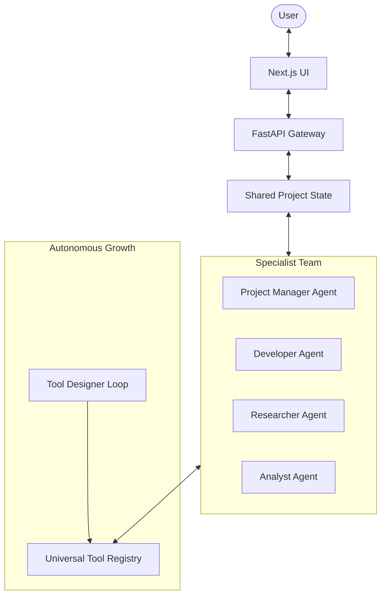

# Mainstay Architecture: Collaborative Specialist Framework

Mainstay is built on a decentralized multi-agent architecture where specialist agents share a common "Project Intelligence" layer.

## 1. Decentralized Specialist Nodes
Instead of a single executor, Mainstay uses multiple specialized agent nodes that can be dynamically invoked.

## 2. Project Intelligence (Shared State)
- **Shared Memory**: A vector-store or JSON state that holds all project requirements, discovered data, and decisions.
- **Goal DAG**: A dynamic graph of tasks that agents update in real-time.
- **Communication Bus**: A priority-based event system where agents notify each other (e.g., "Developer created a script, Analyst needs to verify").

## 3. Universal Tool Registry & Meta-Tooling
- **Base Tools**: Search, Terminal, Database, File System.
- **Dynamic Tools**: Tools created on-the-fly by the `Tool Designer Loop`.
- **Registry API**: A unified interface for any specialist to discover and use both base and dynamic tools.

## 4. Execution Cycle (Autonomous)
1. **User Goal** -> PM Agent decomposes into tasks.
2. **Assignment** -> Specialists pick tasks from the `Goal DAG`.
3. **Execution/Creation** -> Specialist uses an existing tool OR triggers the `Tool Designer` to create one.
4. **Verification** -> Another specialist reviews the output.
5. **Updating State** -> The `Project Intelligence` is updated, potentially triggering new tasks.
