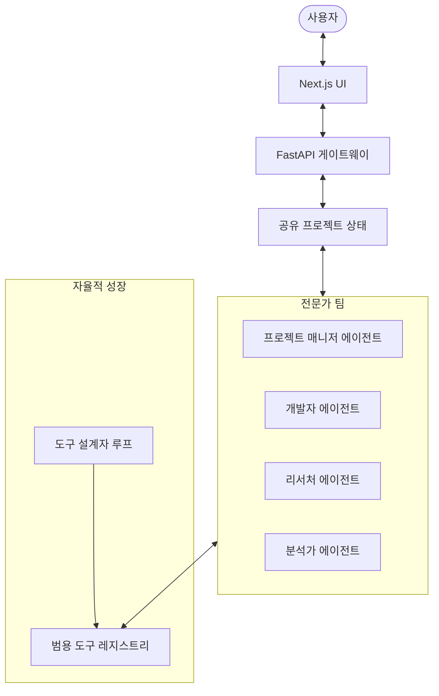

# Mainstay 아키텍처: 협업 전문가 프레임워크
- **버전**: 1.0.0
- **작성 시간**: 2025-12-27 16:57

Mainstay는 전문가 에이전트들이 공통의 "프로젝트 인텔리전스(Project Intelligence)" 계층을 공유하는 분산형 멀티 에이전트 아키텍처를 기반으로 구축되었습니다.

## 1. 분산형 전문가 노드
Mainstay는 단일 실행기 대신 동적으로 호출할 수 있는 여러 전문 에이전트 노드를 사용합니다.

## 2. 프로젝트 인텔리전스 (공유 상태)
- **공유 메모리**: 모든 프로젝트 요구 사항, 발견된 데이터 및 결정을 보유하는 벡터 저장소 또는 JSON 상태.
- **목표 DAG (Goal DAG)**: 에이전트가 실시간으로 업데이트하는 작업의 동적 그래프.
- **통신 버스**: 에이전트가 서로에게 알림을 보내는 우선 순위 기반 이벤트 시스템 (예: "개발자가 스크립트를 생성함, 분석가의 확인 필요").

## 3. 범용 도구 레지스트리 및 Meta-Tooling
- **기본 도구**: 검색, 터미널, 데이터베이스, 파일 시스템.
- **동적 도구**: `도구 설계자 루프`에 의해 즉석에서 생성된 도구.
- **레지스트리 API**: 모든 전문가가 기본 도구와 동적 도구를 모두 검색하고 사용할 수 있는 통합 인터페이스.

## 4. 실행 주기 (자율형)
1. **사용자 목표** -> PM 에이전트가 목표를 작업으로 분해합니다.
2. **할당** -> 전문가가 `목표 DAG`에서 작업을 선택합니다.
3. **실행/생성** -> 전문가는 기존 도구를 사용하거나 `도구 설계자`를 트리거하여 도구를 만듭니다.
4. **검증** -> 다른 전문가가 결과물을 검토합니다.
5. **상태 업데이트** -> `프로젝트 인텔리전스`가 업데이트되어 잠재적으로 새로운 작업을 트리거합니다.
